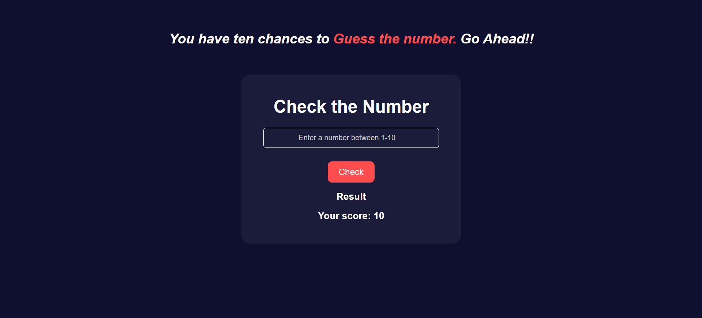

# 🎯 Guess the Number Game

Test your luck and intuition in this fun **Guess the Number** game!  
You have 10 chances to guess the correct number between 1 and 10. Will you score a perfect 10?

---

## 🖼️ Screenshot

---

## 🎮 Features

- 🔢 Random number generated between 1-10
- 💥 Score tracking out of 10
- ⚠️ Live result feedback
- 🧠 Encourages logical thinking and guessing skills
- 🌙 Stylish dark-themed UI

---

## 🛠️ Tech Stack

- **HTML5** – Structure  
- **CSS3** – Styling and layout  
- **JavaScript** – Game logic and interactivity

---

## 🚀 How to Run Locally

   bash

1. Clone the repo:
   git clone https://github.com/vinaya2007/Guess-the-Number.git

2. Navigate to the project folder:
   cd Guess-the-Number

3. Open `index.html` in your browser.

## 📬 Contact
📧 vinayavinodh07@gmail.com
📞 +91 90032 80933

## Credits

Built by Vinaya V
